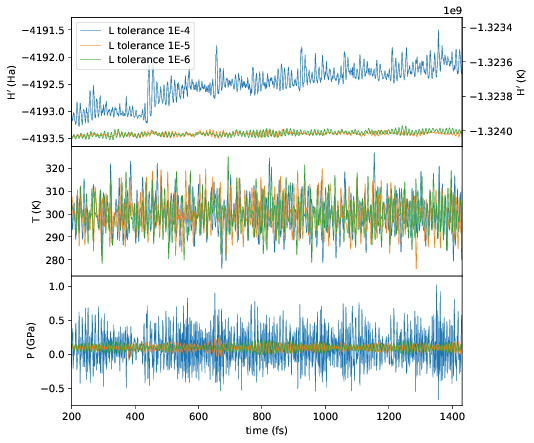
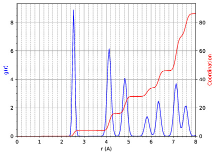

.. _important:

================
Important Topics
================

Diagonalisation
===============

Self-consistency
================

Basis functions
===============

Support functions
=================

Grids and integration
=====================

Tolerances
==========

Functionals
===========

Restarting
==========

Load balancing and partitions
=============================

Structural Relaxation
=====================

.. _molecular-dynamics-topic:

Molecular Dynamics
==================

Self-consistency tolerance and XL-BOMD
--------------------------------------

Self-consistency tolerance is a critical parameter, because it can be
responsible for "drift" in the conserved quantity of the dynamics if it is not
tight enough. Although the molecular dynamics integrators used in CONQUEST are
time reversible, *the SCF procedure is not*. Therefore a tight SCF tolerance
(``minE.SCTolerance`` for diagonalisation, ``minE.LTolerance`` for order(N)) is
necessary. In the case of diagonalisation, a value of ``1E-8`` is typically
enough to negate the drift. However, extended-Lagrangian Born-Oppenheimer MD
(XL-BOMD), currently only implemented for order(N), essentially makes the SCF
component of the MD time-reversible by adding the electronic degrees of freedom
to the Lagrangian, relaxing the constraint on ``minE.LTolerance`` --- although
it is still somewhat dependent on the ensemble. In the NVE and NVT ensembles, a
L-tolerance of ``1E-5`` has been found to be sufficient to give good energy
conservations, decreasing to ``1E-6`` in the NPT ensemble. The following flags
are required for XL-BOMD:

::

   DM.SolutionMethod ordern
   AtomMove.ExtendedLagrangian T

Restarting
----------

Assuming the calculation ended gracefully, it can easily be restarted by
setting,

::

   AtomMove.RestartRun T

This will do several things: it will read the atomic coordinates from
``md.positions`` and read the ``md.checkpoint`` file, which contains the
velocities and extended system (Nose-Hoover chain and cell) variables. Depending
on the value of ``DM.SolutionMethod``, it will read the K-matrix files
(``diagon``) or the L-matrix files (``ordern``), and if XL-BOMD is being used,
the X-matrix files. Finally, it will *append* new data to the ``md.stats`` and
``md.frames`` files, but it will overwrite all other files, including
``Conquest_out``. Note that this flag is equivalent to setting the following:

::

   General.LoadL T
   SC.MakeInitialChargeFromK T
   XL.LoadL T

If the calculation ended by hitting the walltime limit, the writing of the
matrix files may have been interrupted, rendering them unusable. In this case,
the calculation can be restarted by setting the above flags to ``F`` *after*
setting ``AtomMove.RestartRun T``. Setting the flag ``General.MaxTime`` to some
number of seconds less (say 30 minutes) than the calculation wall time limit
will force the calculation to stop gracefully, preventing the aforementioned
situation.

Visualising the trajectory
--------------------------

Setting the flag ``AtomMove.WriteXSF T`` dumps the coordinates to the file
``trajectory.xsf`` every ``AtomMove.OutputFreq`` steps. The .xsf file can be
read using `VMD <https://www.ks.uiuc.edu/Research/vmd/>`_. A small VMD script,
``view.vmd`` is included with the code, and can be invoked using,

``vmd -e view.vmd``

assuming the vmd executable is in your path.

Non-Hamlitonian dynamics
------------------------

Canonical (NVT) ensemble
++++++++++++++++++++++++

The thermostat is set using the ``MD.Thermostat`` flag, and can take the values
``berendsen`` (weak coupling), ``nhc`` (Nose-Hoover chain) and ``svr``
(stochastic velocity rescaling). Without going into the details of the
thermostat, one would typically use the NHC or SVR thermostats, because they
genterate the correct canonical ensemble phase space distribution.

1. Berendsen

::

   AtomMove.IonTemperature 300.0
   MD.Ensemble nvt
   MD.Thermostat berendsen
   MD.tauT 5
   
Here, ``MD.tauT`` is the coupling timescale; the velocity scaling factor is
modified by a factor :math:`\Delta t/\tau`, so a larger :math:`\tau` results in
a more slowly varying temperature. Note that this method does not recover the
canonical ensemble, and is oly useful for equilibration. Moreover, it has been
shown to systematically transfer energy to the slowest degrees of freedom, a
phenomenon known as the "flying ice cube effect." Use with care.

2. Nose-Hoover chain

::

   AtomMove.IonTemperature 300.0
   MD.Ensemble nvt
   MD.Thermostat nhc
   MD.nNHC 5
   MD.nYoshida 5
   MD.tauT 30

When thermostatting using a Nose-Hoover chain, it may be necessary to set a
couple more flags. ``MD.nNHC`` sets the number of thermostats in the chain (the
default of 5 is generally sensible), and ``MD.nYoshida`` determines the order of
Yoshida-Suzuki integration. This is essentially a higher level integration
scheme that *can* improve energy conservation in cases when rapid changes in the
Nose-Hoover thermostat velocity is causing integration errors. **Note that
``MD.tauT`` means something different to the Berendsen case**. A good guess is
the time period of the highest frequency motion of the system in fs; however, in
the NVT ensemble, the energy conservation is not very sensitive to this value.
The NHC masses can also be set manually using the following block.

::

   MD.CalculateXLMass F
   MD.nNHC 5
   %block MD.NHCmass
     5 1 1 1 1
   %endblock

3. Stochastic velocity rescaling

::

   AtomMove.IonTemperature 300.0
   MD.Ensemble nvt
   MD.Thermostat svr
   MD.tauT 10

While the NHC uses chaotic sensitivity to initial conditions to achieve better
ergodicity, the SVR thermostat uses a judiciously chosen stochastic force
coupled to a Berendsen-type weak scaling thermostat to correctly generate the
canonical phase space distribution. As such, the ``MD.tauT`` parameter has the
same meaning as for the Berendsen barostat. It has the advantage of not
producing a flying ice cube effect. To reproduce a simulation, the random number
generator seed can be set with the ``General.RNGSeed <integer>`` flag.

Isobaric-Isothermal (NPT) ensemble
++++++++++++++++++++++++++++++++++

There are two implemented barostats, weak coupling (Berendsen) and extended
system (Parrinello-Rahman). As with the thermostats, the weak coupling barostat
does not generate the correct phase space distribution, while the extended
system barostat does.

1. Berendsen

::

   AtomMove.IonTemperature 300.0
   MD.Ensemble npt
   MD.Thermostat berendsen
   MD.Barostat berendsen
   MD.tauT 5
   MD.tauP 30
   MD.BulkModulusEstimate 100.0

Note that the Berendsen barostat can only be used with the Berendsen thermostat.
The pressure time coupling parameter ``MD.tauP`` has an analogous meaning to the
temperature parameter ``MD.tauT``, but in this case is quite important, since
rapid fluctuations in the cell parameters can destabilise or crash a simulation.
One possible strategy to equilibrate a system that is far from its target
pressure and volume is to relax it using the Berendsen barostat/thermostat with
a large value of ``MD.tauP``, i.e. an over-damped system. Note the necessity of
a bulk modulus estimate (in GPa), which is a parameter in the cell rescaling.

2. Parrinello-Rahman

::

   AtomMove.IonTemperature 300.0
   AtomMove.TargetPressure 10.0
   MD.Ensemble npt
   MD.Thermostat nhc
   MD.Barostat pr
   MD.nNHC 5
   MD.nYoshida 5
   MD.tauT 100
   MD.tauP 200
   MD.PDrag 10.0

The Parrinello-Rahman barostat generates the correct ensemble unlike the
Berendsen, but can be subject to low frequency "ringing" fluctuations in the
temperature and pressure that can destabilise the system or slow equilibration.
Unlike in the NVT ensemble, this combination of barostat and thermostat is
*very* sensitive to the choice of both ``MD.tauT`` and ``MD.tauP``; note that
their values are somewhat higher in this case, since integration errors in the
NHC tend to be more severe due to coupling of the cell and atomic motions. They
are dependent on the system, so it is advised that you find a combination of
these parameters that gives the best energy conservation. The cell is
thermostatted using a separate Nose-Hoover chain to the atoms by default, but
they can be controlled with the same chain by setting ``MD.CellNHC F``. An *ad
hoc* drag factor specified by ``MD.PDrag`` reduces the thermostat and cell
velocities at every timestep to damp out the ringing fluctuations. In this case,
they are reduced by :math:`10/200 ~ 5%`, which strictly speaking breaks the NPT
dynamicss, but not significantly, and the stability is significantly improved.

Note that the NPT ensemble can also be generated correctly by thermostatting
using the SVR thermostat, although the meaning of the parameter ``MD.tauT`` is
different in this case, akin to the Berendsen thermostat.

Postprocessing tools
--------------------

Several scripts that may be helpful with postprocessing molecular dynamics are
included with CONQUEST. The can be found in the ``tools`` directory, and the
executables are ``plot_stats.py``, ``md_analysis.py`` and ``heat_flux.py``. They
have the following dependencies:

  * Python 3
  * Scipy/Numpy
  * Matplotlib

If Python 3 is installed the modules can be added easily using ``pip3 install
scipy`` etc.

These scripts should be run in the calculation directory, and will automatically
parse the necessary files, namely ``Conquest_input``, ``input.log``,
``md.stats`` and ``md.frames`` assuming they have the default names. They will
also read the CONQUEST input flags to determine, for example, what ensemble is
used, and process the results accordingly.

Plotting statistics
+++++++++++++++++++

::

  usage: plot_stats.py [-h] [-c] [-d DIRS [DIRS ...]]
                      [--description DESC [DESC ...]] [--skip NSKIP]
                      [--stop NSTOP] [--equil NEQUIL] [--landscape]
                      [--mser MSER_VAR]

  Plot statistics for a Conquest MD trajectory

  optional arguments:
    -h, --help            show this help message and exit
    -c, --compare         Compare statistics of trajectories in directories
                          specified by -d (default: False)
    -d DIRS [DIRS ...], --dirs DIRS [DIRS ...]
                          Directories to compare (default: .)
    --description DESC [DESC ...]
                          Description of graph for legend (only if using
                          --compare) (default: )
    --skip NSKIP          Number of equilibration steps to skip (default: 0)
    --stop NSTOP          Number of last frame in analysis (default: -1)
    --equil NEQUIL        Number of equilibration steps (default: 0)
    --landscape           Generate plot with landscape orientation (default:
                          False)
    --mser MSER_VAR       Compute MSER for the given property (default: None)

Running ``plot_stats.py --skip 200`` in your calculation will generate a plot
which should resemble the example below, skipping the first 200 steps. This
example is a molecular dynamics simulation of 1000 atoms of bulk silicon in the
NPT ensemble, at 300 K and 0.1 GPa.

.. image:: stats.jpg

The four plots are respectively the breakdown of energy contributions, the
conserved quantity, the temperature and the pressure, the last of which is only
included for NPT molecular dynamics. Several calculations in different
directories can be compared using ``plot_stats.py --compare -d dir1
dir2 --description "dir1 description" "dir2 description"``. The following
example compares the effect of changing the L tolerance in the above simulation.
Note that the contents of the description field will be in the legend of the
plot.

MD analysis
+++++++++++

::

  usage: md_analysis.py [-h] [-d DIRS [DIRS ...]] [--skip NSKIP]
                        [--stride STRIDE] [--snap SNAP] [--stop NSTOP]
                        [--equil NEQUIL] [--vacf] [--msd] [--rdf] [--stress]
                        [--nbins NBINS] [--rdfwidth RDFWIDTH] [--rdfcut RDFCUT]
                        [--window WINDOW] [--fitstart FITSTART] [--dump]

  Analyse a Conquest MD trajectory

  optional arguments:
    -h, --help            show this help message and exit
    -d DIRS [DIRS ...], --dirs DIRS [DIRS ...]
                          Directories to compare (default: .)
    --skip NSKIP          Number of equilibration steps to skip (default: 0)
    --stride STRIDE       Only analyse every nth step of frames file (default:
                          1)
    --snap SNAP           Analyse Frame of a single snapshot (default: -1)
    --stop NSTOP          Number of last frame in analysis (default: -1)
    --equil NEQUIL        Number of equilibration steps (default: 0)
    --vacf                Plot velocity autocorrelation function (default:
                          False)
    --msd                 Plot mean squared deviation (default: False)
    --rdf                 Plot radial distribution function (default: False)
    --stress              Plot stress (default: False)
    --nbins NBINS         Number of histogram bins (default: 100)
    --rdfwidth RDFWIDTH   RDF histogram bin width (A) (default: 0.05)
    --rdfcut RDFCUT       Distance cutoff for RDF in Angstrom (default: 8.0)
    --window WINDOW       Window for autocorrelation functions in fs (default:
                          1000.0)
    --fitstart FITSTART   Start time for curve fit (default: -1.0)
    --dump                Dump secondary data used to generate plots (default:
                          False)

The script ``md_analysis.py`` script performs various analyses of the trajectory
by parsing the `md.frames`` file. So far, these include the radial distribution
function, the velocity autocorrelation funciton, the mean squared deviation, and
plotting the stress. For example, the command,

``md_analysis.py --rdf --stride 20 --rdfcut 8.0 --nbins 100 --dump --skip 200 --stop 400``

computes the radial distribution function of the simulation in the first example
from every 20th time step (every 10 fs in this case), stopping after 400 steps,
with a cutoff of 8.0 A, and the histogram is divided into 100 bins.

CONQUEST structure file analysis
++++++++++++++++++++++++++++++++

::

  usage: structure.py [-h] [-i INFILE] [--bonds] [--density] [--nbins NBINS]
                      [-c CUTOFF [CUTOFF ...]] [--printall]

  Analyse a CONQUEST-formatted structure

  optional arguments:
    -h, --help            show this help message and exit
    -i INFILE, --infile INFILE
                          Conquest format structure file (default:
                          coord_next.dat)
    --bonds               Compute average and minimum bond lengths (default:
                          False)
    --density             Compute density (default: False)
    --nbins NBINS         Number of histogram bins (default: 100)
    -c CUTOFF [CUTOFF ...], --cutoff CUTOFF [CUTOFF ...]
                          Bond length cutoff matrix (upper triangular part, in
                          rows (default: None)
    --printall            Print all bond lengths (default: False)

The script ``structure.py`` can be used to analyse a CONQUEST-formatted
structure file. This is useful to sanity-check the bond lengths or density,
since an unphysical structure is so often the cause of a crash. For example, the
bond lengths can be computed with

``structure.py --bonds -c 2.0 3.0 3.0``

where the ``-c`` flag specifies the bond cutoffs for the bonds 1-1, 1-2 and 2-2,
where 1 is species 1 as specified in ``Conquest_input`` and 2 is species 2. The
output will look something like this:

::

  Mean bond lengths:
  O-Si:   1.6535 +/-   0.0041 (24 bonds)
  Minimum bond lengths:
  O-Si:   1.6493
