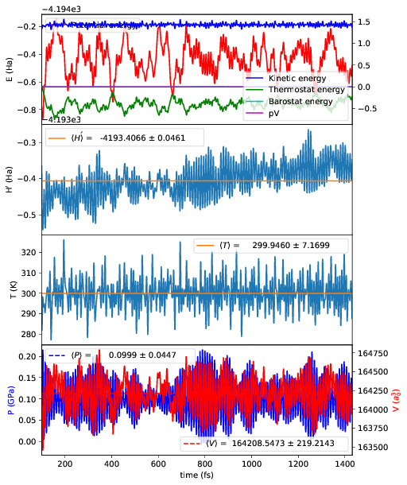

.. _ext-tools:

==============
External tools
==============

.. _et_post_process:

Post-processing for charge density, band density, DOS, STM
----------------------------------------------------------

The utility ``PostProcessCQ`` allows users to post-process the output
of a CONQUEST calculation, to produce the charge density, band
densities, DOS and STM images in useful forms.  It is described fully :ref:`here <post-proc>`.

.. _et_md_scripts:

Molecular dynamics analysis
---------------------------

Several scripts that may be helpful with postprocessing molecular dynamics are
included with CONQUEST. The can be found in the ``tools`` directory, and the
executables are ``plot_stats.py``, ``md_analysis.py`` and ``heat_flux.py``. They
have the following dependencies:

  * Python 3
  * Scipy/Numpy
  * Matplotlib

If Python 3 is installed the modules can be added easily using ``pip3 install
scipy`` etc.

These scripts should be run in the calculation directory, and will automatically
parse the necessary files, namely ``Conquest_input``, ``input.log``,
``md.stats`` and ``md.frames`` assuming they have the default names. They will
also read the CONQUEST input flags to determine, for example, what ensemble is
used, and process the results accordingly.

Go to :ref:`top <ext-tools>`.

.. _et_plot_stat:

Plotting statistics
+++++++++++++++++++

::

  usage: plot_stats.py [-h] [-c] [-d DIRS [DIRS ...]]
                      [--description DESC [DESC ...]] [--skip NSKIP]
                      [--stop NSTOP] [--equil NEQUIL] [--landscape]
                      [--mser MSER_VAR]

  Plot statistics for a CONQUEST MD trajectory

  optional arguments:
    -h, --help            show this help message and exit
    -c, --compare         Compare statistics of trajectories in directories
                          specified by -d (default: False)
    -d DIRS [DIRS ...], --dirs DIRS [DIRS ...]
                          Directories to compare (default: .)
    --description DESC [DESC ...]
                          Description of graph for legend (only if using
                          --compare) (default: )
    --skip NSKIP          Number of equilibration steps to skip (default: 0)
    --stop NSTOP          Number of last frame in analysis (default: -1)
    --equil NEQUIL        Number of equilibration steps (default: 0)
    --landscape           Generate plot with landscape orientation (default:
                          False)
    --mser MSER_VAR       Compute MSER for the given property (default: None)

Running ``plot_stats.py --skip 200`` in your calculation will generate a plot
which should resemble the example below, skipping the first 200 steps. This
example is a molecular dynamics simulation of 1000 atoms of bulk silicon in the
NPT ensemble, at 300 K and 0.1 GPa.

The four plots are respectively the breakdown of energy contributions, the
conserved quantity, the temperature and the pressure, the last of which is only
included for NPT molecular dynamics. Several calculations in different
directories can be compared using ``plot_stats.py --compare -d dir1
dir2 --description "dir1 description" "dir2 description"``. The following
example compares the effect of changing the L tolerance in the above simulation.
Note that the contents of the description field will be in the legend of the
plot.

.. image:: compare.jpg

Go to :ref:`top <ext-tools>`.

.. _et_md_ana:

MD analysis
+++++++++++

::

  usage: md_analysis.py [-h] [-d DIRS [DIRS ...]] [--skip NSKIP]
                        [--stride STRIDE] [--snap SNAP] [--stop NSTOP]
                        [--equil NEQUIL] [--vacf] [--msd] [--rdf] [--stress]
                        [--nbins NBINS] [--rdfwidth RDFWIDTH] [--rdfcut RDFCUT]
                        [--window WINDOW] [--fitstart FITSTART] [--dump]

  Analyse a CONQUEST MD trajectory

  optional arguments:
    -h, --help            show this help message and exit
    -d DIRS [DIRS ...], --dirs DIRS [DIRS ...]
                          Directories to compare (default: .)
    --skip NSKIP          Number of equilibration steps to skip (default: 0)
    --stride STRIDE       Only analyse every nth step of frames file (default:
                          1)
    --snap SNAP           Analyse Frame of a single snapshot (default: -1)
    --stop NSTOP          Number of last frame in analysis (default: -1)
    --equil NEQUIL        Number of equilibration steps (default: 0)
    --vacf                Plot velocity autocorrelation function (default:
                          False)
    --msd                 Plot mean squared deviation (default: False)
    --rdf                 Plot radial distribution function (default: False)
    --stress              Plot stress (default: False)
    --nbins NBINS         Number of histogram bins (default: 100)
    --rdfwidth RDFWIDTH   RDF histogram bin width (A) (default: 0.05)
    --rdfcut RDFCUT       Distance cutoff for RDF in Angstrom (default: 8.0)
    --window WINDOW       Window for autocorrelation functions in fs (default:
                          1000.0)
    --fitstart FITSTART   Start time for curve fit (default: -1.0)
    --dump                Dump secondary data used to generate plots (default:
                          False)

The script ``md_analysis.py`` script performs various analyses of the trajectory
by parsing the `md.frames`` file. So far, these include the radial distribution
function, the velocity autocorrelation function, the mean squared deviation, and
plotting the stress. For example, the command,

``md_analysis.py --rdf --stride 20 --rdfcut 8.0 --nbins 100 --dump --skip 200 --stop 400``

computes the radial distribution function of the simulation in the first example
from every 20th time step (every 10 fs in this case), stopping after 400 steps,
with a cutoff of 8.0 A, and the histogram is divided into 100 bins.

.. image:: rdf.jpg

Go to :ref:`top <ext-tools>`.

.. _et_cq_struc:

CONQUEST structure file analysis
++++++++++++++++++++++++++++++++

::

  usage: structure.py [-h] [-i INFILE] [--bonds] [--density] [--nbins NBINS]
                      [-c CUTOFF [CUTOFF ...]] [--printall]

  Analyse a CONQUEST-formatted structure

  optional arguments:
    -h, --help            show this help message and exit
    -i INFILE, --infile INFILE
                          CONQUEST format structure file (default:
                          coord_next.dat)
    --bonds               Compute average and minimum bond lengths (default:
                          False)
    --density             Compute density (default: False)
    --nbins NBINS         Number of histogram bins (default: 100)
    -c CUTOFF [CUTOFF ...], --cutoff CUTOFF [CUTOFF ...]
                          Bond length cutoff matrix (upper triangular part, in
                          rows (default: None)
    --printall            Print all bond lengths (default: False)

The script ``structure.py`` can be used to analyse a CONQUEST-formatted
structure file. This is useful to sanity-check the bond lengths or density,
since an unphysical structure is so often the cause of a crash. For example, the
bond lengths can be computed with

``structure.py --bonds -c 2.0 3.0 3.0``

where the ``-c`` flag specifies the bond cutoffs for the bonds 1-1, 1-2 and 2-2,
where 1 is species 1 as specified in ``Conquest_input`` and 2 is species 2. The
output will look something like this:

::

  Mean bond lengths:
  O-Si:   1.6535 +/-   0.0041 (24 bonds)
  Minimum bond lengths:
  O-Si:   1.6493

Go to :ref:`top <ext-tools>`.

Atomic Simulation Environment (ASE)
-----------------------------------

.. _et_ase_cq:

`ASE <https://wiki.fysik.dtu.dk/ase>`_ is a set of 
Python tools for setting up, manipulating, running, visualizing and analyzing 
atomistic simulations. ASE contains a CONQUEST interface, also
called *Calculator* so that it can be used to calculate ``energies``, ``forces`` 
and ``stresses`` as inputs to other calculations such as `Phonon <https://wiki.fysik.dtu.dk/ase/ase/phonons.html#module-ase.phonons>`_ 
or `NEB <https://wiki.fysik.dtu.dk/ase/ase/neb.html#module-ase.neb>`_ that 
are not implemented in CONQUEST. ASE is a versatil tool to manage CONQUEST
calculations without pain either: 

* in a **direct** way where pre-processing, calculation and post-processing are managed on-the-fly by ASE, 
* or in an **indirect** way where the calculation step is performed outside the workflow, ie. on a supercomputer.

The ASE repository containing the Conquest calculator can be
found `here <https://gitlab.com/lionelalexandre/ase-Conquest/-/tree/master?ref_type=heads>`_.
Detailed documentation on how to manage Conquest calculations
with ASE is available :ref:`here <ase-conquest>`.

Go to :ref:`top <ext-tools>`.
