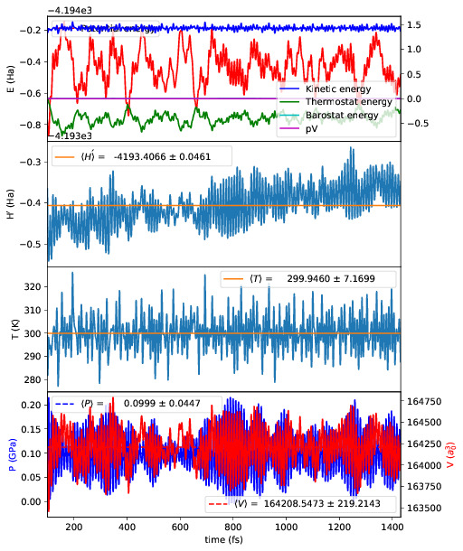
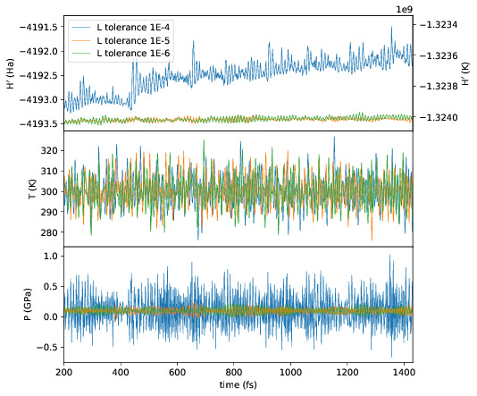
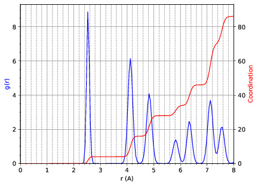

.. _ext-tools:

==============
External tools
==============

.. _et_post_process:

Post-processing for charge density, band density, DOS, STM
----------------------------------------------------------

The utility ``PostProcessCQ`` allows users to post-process the output
of a CONQUEST calculation, to produce the charge density, band
densities, DOS and STM images in useful forms.  It is described fully :ref:`here <post-proc>`.

.. _et_md_scripts:

Molecular-dynamics analysis
---------------------------

The consolidated ``md_analysis.py`` utility is located in
``src/utilities``.  It can plot the thermodynamic statistics written by
CONQUEST and analyse trajectories for radial distribution functions (RDFs),
velocity autocorrelation functions (VACFs), mean-squared displacements (MSDs)
and stress.  It can also compare the statistics from several calculations and
calculate heat-flux autocorrelation functions (HFACFs).

The utility requires Python 3, NumPy, SciPy and Matplotlib.  Run it from the
calculation directory, giving the path to the copy in the CONQUEST source tree,
for example:

::

  python3 /path/to/CONQUEST/src/utilities/md_analysis.py [options]

The utility reads ``Conquest_input`` and the coordinate file named there.  By
default, the MD data are read from ``md.stats``, ``md.frames`` and, for an
HFACF, ``md.heatflux``.  A different statistics or frames file can be selected
with ``--stats FILE`` or ``--frames FILE``.  CONQUEST controls how often
frames are written to ``md.frames`` with ``AtomMove.OutputFreq``; statistics
are written to ``md.stats`` at every MD step.

Plotting statistics
+++++++++++++++++++

With no analysis option, the utility plots the energy contributions, conserved
quantity, temperature and pressure from ``md.stats`` and writes ``stats.pdf``.
For an NPT calculation it also plots the volume.  For example,

::

  python3 /path/to/CONQUEST/src/utilities/md_analysis.py --skip 200

omits the first 200 MD steps from the plots.  ``--equil N`` independently sets
the initial part omitted when calculating averages, while ``--landscape`` uses
a two-by-two plot layout.

Statistics from calculations in several directories can be compared with
``--compare``.  Supply the directories with ``--dirs`` and, optionally, one
legend label per directory with ``--description``:

::

  python3 /path/to/CONQUEST/src/utilities/md_analysis.py \
      --compare --dirs dir1 dir2 \
      --description "first calculation" "second calculation"

Trajectory analysis
+++++++++++++++++++

The options ``--rdf``, ``--vacf``, ``--msd`` and ``--stress`` select analyses
of ``md.frames``.  ``--stride N`` uses every Nth frame, ``--skip N`` ignores
the initial part of the trajectory and ``--stop N`` sets the final MD step to
analyse.  ``--dump`` writes the numerical data used for RDF, VACF and MSD plots
in addition to the PDF output.

For example,

::

  python3 /path/to/CONQUEST/src/utilities/md_analysis.py \
      --rdf --stride 20 --rdfcut 8.0 --rdfwidth 0.08 \
      --dump --skip 200 --stop 400

calculates an RDF with an 8 Angstrom cutoff and 0.08 Angstrom bin width, using
every twentieth selected frame.  The results are written to ``rdf.pdf`` and,
because ``--dump`` is present, ``rdf.dat``.

The VACF and MSD analyses similarly write ``vacf.pdf`` and ``msd.pdf``, with
``vacf.dat`` and ``msd.dat`` requested by ``--dump``.  ``--stress`` writes
``stress.pdf``; for an NPT trajectory the cell dimensions are plotted with the
stress.

For heat-flux analysis, enable ``MD.HeatFlux`` in the CONQUEST calculation and
use ``--hfacf --acfwindow T``, where ``T`` is the autocorrelation-window length
in femtoseconds.  The utility reads ``md.heatflux`` and writes ``hfacf.pdf``.

Go to :ref:`top <ext-tools>`.

Atomic Simulation Environment (ASE)
-----------------------------------

.. _et_ase_cq:

`ASE <https://wiki.fysik.dtu.dk/ase>`_ is a set of 
Python tools for setting up, manipulating, running, visualizing and analyzing 
atomistic simulations. ASE contains a CONQUEST interface, also 
called *Calculator* so that it can be used to calculate ``energies``, ``forces`` 
and ``stresses`` as inputs to other calculations such as `Phonon <https://wiki.fysik.dtu.dk/ase/ase/phonons.html#module-ase.phonons>`_ 
or `NEB <https://wiki.fysik.dtu.dk/ase/ase/neb.html#module-ase.neb>`_ that 
are not implemented in CONQUEST. ASE is a versatile tool to manage CONQUEST
calculations without pain either: 

* in a **direct** way where pre-processing, calculation and post-processing are managed on-the-fly by ASE, 
* or in an **indirect** way where the calculation step is performed outside the workflow, ie. on a supercomputer.

The ASE repository containing the Conquest calculator can be
found `here <https://gitlab.com/lionelalexandre/ase-Conquest/-/tree/master?ref_type=heads>`_.
Detailed documentation on how to manage Conquest calculations
with ASE is available :ref:`here <ase-conquest>`.

Go to :ref:`top <ext-tools>`.
